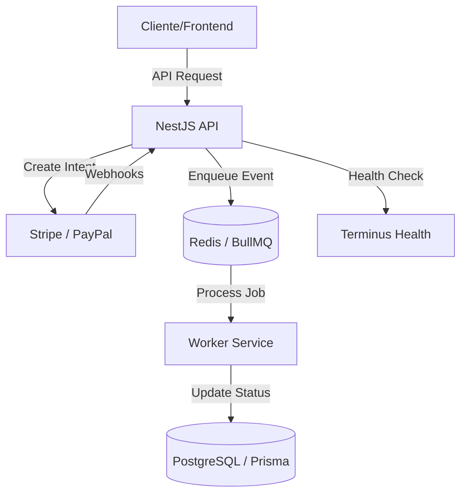

# Middleware de Pagos Universal (Fintech)


Microservicio de pagos robusto y escalable que abstrae la complejidad de múltiples proveedores (Stripe y PayPal) en una interfaz unificada.

## 🏗️ Arquitectura del Sistema

El middleware utiliza una arquitectura dirigida por eventos para garantizar que ninguna notificación de pago se pierda.



## 🚀 Características Principales

- **Abstracción de Proveedores**: Una sola API para manejar flujos de Stripe y PayPal.
- **Procesamiento Asíncrono**: Uso de BullMQ y Redis para manejar Webhooks.
- **Persistencia Confiable**: PostgreSQL gestionado a través de Prisma ORM.
- **Monitoreo de Salud**: Endpoint `/health` integrado con Docker.
- **Logging Profesional**: Implementación del Logger nativo de NestJS.
- **Documentación Interactiva**: Swagger UI en `/api`.

## 📥 Instalación y Configuración

```bash
# 1. Copiar variables de entorno
cp .env.example .env

# 2. Iniciar con Docker
docker-compose up -d

# 3. Ejecutar migraciones
docker-compose exec app npx prisma migrate dev
```

## 📖 Documentación de la API

🔗 **Swagger UI**: `http://localhost:3000/api`
🔗 **Health Check**: `http://localhost:3000/health`

## 🔄 Flujo de Webhooks

1. **Recepción**: El middleware recibe el webhook y valida la firma.
2. **Encolado**: El evento se guarda en Redis y se responde `200 OK`.
3. **Procesamiento**: Un worker consume el evento de forma asíncrona.
4. **Actualización**: Se actualiza el estado del pago en PostgreSQL.

---
Desarrollado para ecosistemas Fintech modernos.
